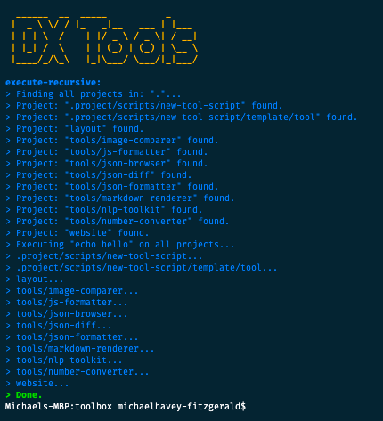
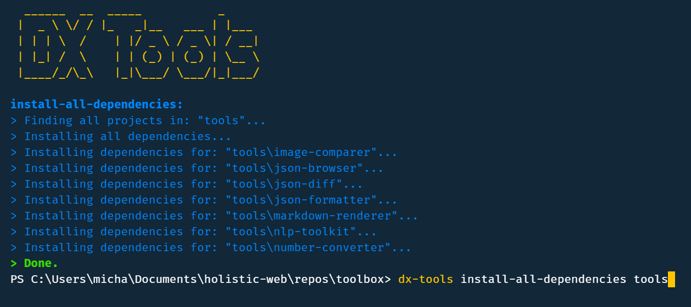

# DX Tools
https://www.npmjs.com/package/dx-tools

A CLI of useful tools to improve [developer experience](https://hackernoon.com/developer-experience-dx-devs-are-people-too-6590d6577afe).



## Installation
To install this CLI globally run
```
npm install dx-tools --global
```

## Commands

### `install-all-dependencies`
```
dx-tools install-all-dependencies <folder>
```
Installs all dependencies for projects within a folder.

The first argument given is the path to the folder to work on, if none is provided it will default to the current directory.



## Contributing

### Development
This project can be tested locally by cloning this repo and then running:
```
npm install
npm link
```
This will tell your machine to use the code on your machine for subsequent calls to `dx-tools`.


### Publishing
This project will automatically publish on merge to master branch. Should there be an issue with that it can be published with:
```
npm publish
```
